# ColabX Database ER Diagram

```mermaid
erDiagram
    %% Core Auth Tables
    USER ||--o{ SESSION : has
    USER ||--o{ ACCOUNT : has
    USER ||--o{ VERIFICATION : "email-verification"

    %% Organization Structure
    ORGANIZATION ||--o{ ORGUSER : "has-members"
    ORGANIZATION ||--o{ INVITATION : "sends-invitations"
    USER ||--o{ ORGUSER : "joins"

    %% Partner Management
    ORGANIZATION ||--o{ PARTNER : "has-partners"
    PARTNER ||--o{ USER : "linked-to"
    USER ||--o{ PARTNER : "creates"

    %% Team Management
    ORGANIZATION ||--o{ TEAM : "has-teams"
    TEAM ||--o{ TEAMEMBER : "has-members"
    TEAM ||--o{ TEAMPARTNER : "assigned-to"
    USER ||--o{ TEAM : "creates"
    USER ||--o{ TEAMEMBER : "joins-team"
    PARTNER ||--o{ TEAMPARTNER : "assigned-to-team"
    USER ||--o{ TEAMPARTNER : "assigns"

    %% Contact Management
    ORGANIZATION ||--o{ CONTACT : "manages"
    PARTNER ||--o{ CONTACT : "has-contacts"
    USER ||--o{ CONTACT : "creates-contact"

    %% Deal Management
    ORGANIZATION ||--o{ DEAL : "has-deals"
    PARTNER ||--o{ DEAL : "has-deals"
    TEAM ||--o{ DEAL : "manages"
    USER ||--o{ DEAL : "creates-deal"
    DEAL ||--o{ DEALASSIGNMENT : "assigns-to"
    DEAL ||--o{ DEALMESSAGE : "has-messages"
    DEAL ||--o{ DEALTASK : "has-tasks"
    DEAL ||--o{ DEALDOCUMENT : "has-documents"
    USER ||--o{ DEALASSIGNMENT : "assigned-deal"
    USER ||--o{ DEALMESSAGE : "sends-message"
    USER ||--o{ DEALTASK : "assigned-task"
    USER ||--o{ DEALDOCUMENT : "uploads-doc"

    %% OKR Management
    ORGANIZATION ||--o{ OBJECTIVE : "has-objectives"
    PARTNER ||--o{ OBJECTIVE : "has-objectives"
    TEAM ||--o{ OBJECTIVE : "has-objectives"
    OBJECTIVE ||--o{ KEYRESULT : "has-key-results"
    USER ||--o{ OBJECTIVE : "creates-objective"

    %% Collaboration Features
    ORGANIZATION ||--o{ COMMUNICATION : "has-communications"
    ORGANIZATION ||--o{ DOCUMENT : "has-documents"
    ORGANIZATION ||--o{ ACTIVITYLOG : "logs-activity"
    ORGANIZATION ||--o{ NOTIFICATION : "sends-notifications"
    PARTNER ||--o{ COMMUNICATION : "involved-in"
    PARTNER ||--o{ DOCUMENT : "has-documents"
    PARTNER ||--o{ NOTIFICATION : "receives-notification"
    USER ||--o{ COMMUNICATION : "sends-communication"
    USER ||--o{ DOCUMENT : "uploads-document"
    USER ||--o{ ACTIVITYLOG : "performs"
    USER ||--o{ NOTIFICATION : "receives"

    %% Entity Definitions with Key Fields

    USER {
        string id PK
        string name
        string email UK
        boolean emailVerified
        string image
        timestamp createdAt
        timestamp updatedAt
    }

    SESSION {
        string id PK
        string userId FK
        string token UK
        timestamp expiresAt
        string ipAddress
        string userAgent
        timestamp createdAt
        timestamp updatedAt
    }

    ACCOUNT {
        string id PK
        string userId FK
        string accountId
        string providerId
        string accessToken
        string refreshToken
        string idToken
        timestamp accessTokenExpiresAt
        timestamp refreshTokenExpiresAt
        string scope
        string password
        timestamp createdAt
        timestamp updatedAt
    }

    VERIFICATION {
        string id PK
        string identifier
        string value
        timestamp expiresAt
        timestamp createdAt
        timestamp updatedAt
    }

    ORGANIZATION {
        string id PK
        string name
        string slug UK
        string logo
        string industry
        string timezone
        timestamp createdAt
        timestamp updatedAt
    }

    ORGUSER {
        string id PK
        string userId FK
        string orgId FK
        string role "admin|manager|partner"
        timestamp joinedAt
    }

    INVITATION {
        string id PK
        string orgId FK
        string email
        string token UK
        string role "admin|manager|partner"
        string partnerType
        string partnerIndustry
        timestamp expiresAt
        timestamp usedAt
        timestamp createdAt
    }

    PARTNER {
        string id PK
        string orgId FK
        string userId FK "optional"
        string name
        string type "reseller|agent|technology|distributor"
        string status "pending|active|inactive|suspended"
        string contactEmail
        string industry
        timestamp onboardingDate
        real score
        timestamp scoreCalculatedAt
        string createdBy FK
        timestamp createdAt
        timestamp updatedAt
    }

    TEAM {
        string id PK
        string orgId FK
        string name
        string description
        string createdBy FK
        timestamp createdAt
        timestamp updatedAt
    }

    TEAMEMBER {
        string id PK
        string teamId FK
        string userId FK
        string role "lead|member"
        timestamp joinedAt
    }

    TEAMPARTNER {
        string id PK
        string teamId FK
        string partnerId FK "UK"
        string assignedBy FK
        timestamp assignedAt
    }

    CONTACT {
        string id PK
        string orgId FK
        string partnerId FK
        string name
        string email
        string phone
        string role
        boolean isPrimary
        string createdBy FK
        timestamp createdAt
        timestamp updatedAt
    }

    DEAL {
        string id PK
        string orgId FK
        string partnerId FK
        string teamId FK "optional"
        string title
        string description
        real value
        string stage "lead|proposal|negotiation|won|lost"
        string createdBy FK
        timestamp createdAt
        timestamp updatedAt
    }

    DEALASSIGNMENT {
        string id PK
        string dealId FK
        string userId FK
        timestamp assignedAt
    }

    DEALMESSAGE {
        string id PK
        string dealId FK
        string senderId FK
        string content
        timestamp createdAt
    }

    DEALTASK {
        string id PK
        string dealId FK
        string title
        string description
        string assigneeUserId FK "optional"
        string status "todo|in_progress|done"
        timestamp dueDate
        string createdBy FK
        timestamp createdAt
        timestamp updatedAt
        timestamp completedAt
    }

    DEALDOCUMENT {
        string id PK
        string dealId FK
        string uploadedBy FK
        string fileName
        string fileUrl
        string visibility "shared|internal"
        timestamp uploadedAt
    }

    OBJECTIVE {
        string id PK
        string orgId FK
        string partnerId FK "optional"
        string teamId FK "optional"
        string title
        string description
        date startDate
        date endDate
        string createdBy FK
        timestamp createdAt
        timestamp updatedAt
    }

    KEYRESULT {
        string id PK
        string objectiveId FK
        string title
        real targetValue
        real currentValue
        string status "on_track|at_risk|off_track"
        timestamp createdAt
        timestamp updatedAt
    }

    COMMUNICATION {
        string id PK
        string orgId FK
        string partnerId FK
        string senderId FK
        string message
        timestamp createdAt
    }

    DOCUMENT {
        string id PK
        string orgId FK
        string partnerId FK
        string uploadedBy FK
        string fileName
        string fileUrl
        string visibility
        timestamp uploadedAt
    }

    ACTIVITYLOG {
        string id PK
        string orgId FK
        string userId FK
        string entityType
        string entityId
        string action
        timestamp createdAt
    }

    NOTIFICATION {
        string id PK
        string orgId FK
        string recipientId FK
        string partnerId FK "optional"
        string alertType
        string title
        string message
        string severity "info|warning|critical"
        boolean read
        boolean sentViaEmail
        timestamp emailSentAt
        string relatedEntityType
        string relatedEntityId
        timestamp createdAt
        timestamp readAt
    }
```

## Database Schema Summary

### Core Authentication (Better Auth)
- **USER**: User accounts with email verification
- **SESSION**: User sessions with device info
- **ACCOUNT**: OAuth/social provider accounts
- **VERIFICATION**: Email/OTP verification tokens

### Organization & Access Control
- **ORGANIZATION**: Company/workspace
- **ORGUSER**: User-Organization membership with roles (admin, manager, partner)
- **INVITATION**: Invite tokens for new users with role & partner type

### Partner Management
- **PARTNER**: Partner companies (reseller, agent, technology, distributor)
- **CONTACT**: Contacts within partners

### Teams & Collaboration
- **TEAM**: Internal teams within organization
- **TEAMEMBER**: Team membership with role (lead, member)
- **TEAMPARTNER**: Partner assignment to teams

### Deals & Opportunities
- **DEAL**: Sales deals/opportunities linked to partners
- **DEALASSIGNMENT**: User assignments to deals
- **DEALMESSAGE**: In-deal chat/messaging
- **DEALTASK**: Tasks within a deal with status tracking
- **DEALDOCUMENT**: Document sharing within deals

### OKR Management
- **OBJECTIVE**: Goals for org/partner/team with date range
- **KEYRESULT**: Key results for objectives with progress tracking

### Activity & Notifications
- **COMMUNICATION**: Organization-wide messaging
- **DOCUMENT**: Organization/partner document repository
- **ACTIVITYLOG**: Audit log of all entity actions
- **NOTIFICATION**: User alerts with read tracking and email delivery status

## Key Features

✅ **Multi-Tenancy**: Organization-based data isolation
✅ **Role-Based Access**: admin, manager, partner roles
✅ **Partner Lifecycle**: From invitation to active collaboration
✅ **Deal Management**: Full deal pipeline with tasks and documents
✅ **OKR Tracking**: Objectives with key results and status
✅ **Activity Audit**: Complete action logging
✅ **Notifications**: Email-integrated alert system
✅ **Collaboration**: Real-time communication and document sharing

