# ColabX — Database Design Report

**Project:** ColabX — Partner Relationship Management Platform  
**Database:** PostgreSQL (Neon Serverless)  
**ORM:** Drizzle ORM   
---

## Table of Contents

1. [Overview](#1-overview)
2. [Database Architecture](#2-database-architecture)
3. [Table Inventory](#3-table-inventory)
4. [ER Diagram](#4-er-diagram)
5. [Schema Details](#5-schema-details)
6. [Normalization Analysis](#6-normalization-analysis)
7. [Relationships Analysis](#7-relationships-analysis)
8. [Design Decisions](#9-design-decisions)

---

## 1. Overview

ColabX is a **Partner Relationship Management (PRM)** platform that enables organizations to manage partners, deals, teams, objectives, and communications in a multi-tenant environment.

The database is designed around a central **organization** entity that acts as the root tenant. All business data — partners, teams, deals, OKRs, and collaboration — is scoped to an organization, ensuring complete data isolation between tenants.

### Key Design Principles

| Principle | Implementation |
|-----------|---------------|
| **Multi-tenancy** | Every business entity carries an `organizationId` or is reachable via FK chain to one |
| **Surrogate PKs** | All tables use UUID text as primary key — no natural key PKs |
| **Cascading deletes** | Child records are deleted when parent is removed |
| **Audit trail** | `createdByUserId` present on all major entities |
| **Role-based access** | Roles enforced at `orgUser` level (admin, manager, partner) |
| **Normalization** | Schema is in 3NF

---

## 2. Database Architecture

```
PostgreSQL (Neon Serverless)
│
├── Auth Layer (Better Auth)
│   ├── user
│   ├── session
│   ├── account
│   └── verification
│
├── Organization Layer
│   ├── organization       ← Root tenant
│   ├── orgUser            ← User ↔ Org membership + role
│   └── invitation         ← Invite tokens
│
├── Partner Layer
│   ├── partner            ← Core partner entities
│   └── contact            ← Contacts within partners
│
├── Team Layer
│   ├── team               ← Internal org teams
│   ├── teamMember         ← User ↔ Team assignments
│   └── teamPartner        ← Partner ↔ Team assignments
│
├── Deal Layer
│   ├── deal               ← Sales pipeline
│   ├── dealAssignment     ← User ↔ Deal assignments
│   ├── dealMessage        ← In-deal messaging
│   ├── dealTask           ← Tasks per deal
│   └── dealDocument       ← Documents per deal
│
├── OKR Layer
│   ├── objective          ← Goals (org/partner/team)
│   └── keyResult          ← Measurable outcomes per objective
│
└── Collaboration Layer
    ├── communication      ← Partner messaging
    ├── document           ← Shared documents
    ├── activityLog        ← Audit log
    └── notification       ← User alerts
```

---

## 3. Table Inventory

| # | Table | Module | Rows Purpose | PK Type |
|---|-------|--------|-------------|---------|
| 1 | `user` | Auth | One row per registered user | UUID text |
| 2 | `session` | Auth | Active login sessions | UUID text |
| 3 | `account` | Auth | OAuth provider accounts | UUID text |
| 4 | `verification` | Auth | Email/OTP verification tokens | UUID text |
| 5 | `organization` | Org | Tenant workspace | UUID text |
| 6 | `orgUser` | Org | User ↔ Org membership + role | UUID text |
| 7 | `invitation` | Org | Pending invite tokens | UUID text |
| 8 | `partner` | Partner | External partner companies | UUID text |
| 9 | `contact` | Partner | People within partner companies | UUID text |
| 10 | `team` | Team | Internal organizational teams | UUID text |
| 11 | `teamMember` | Team | User ↔ Team membership | UUID text |
| 12 | `teamPartner` | Team | Partner ↔ Team assignment | UUID text |
| 13 | `deal` | Deal | Sales opportunities | UUID text |
| 14 | `dealAssignment` | Deal | User ↔ Deal collaboration | UUID text |
| 15 | `dealMessage` | Deal | In-deal chat messages | UUID text |
| 16 | `dealTask` | Deal | Tasks within a deal | UUID text |
| 17 | `dealDocument` | Deal | Documents attached to a deal | UUID text |
| 18 | `objective` | OKR | Organizational/partner/team goals | UUID text |
| 19 | `keyResult` | OKR | Measurable outcomes per objective | UUID text |
| 20 | `communication` | Collaboration | Partner-level messages | UUID text |
| 21 | `document` | Collaboration | Partner-level shared documents | UUID text |
| 22 | `activityLog` | Collaboration | Full audit log of all actions | UUID text |
| 23 | `notification` | Collaboration | User alerts with email delivery | UUID text |

**Total: 23 tables, 44 FK relationships**

---

## 4. ER Diagram

```mermaid
erDiagram
    USER {
        text id PK
        text name
        text email UK
        boolean emailVerified
        text image
        timestamp createdAt
        timestamp updatedAt
    }
    SESSION {
        text id PK
        text userId FK
        text token UK
        timestamp expiresAt
        text ipAddress
        text userAgent
        timestamp createdAt
        timestamp updatedAt
    }
    ACCOUNT {
        text id PK
        text userId FK
        text accountId
        text providerId
        text accessToken
        text refreshToken
        timestamp accessTokenExpiresAt
        timestamp refreshTokenExpiresAt
        text scope
        text password
        timestamp createdAt
        timestamp updatedAt
    }
    VERIFICATION {
        text id PK
        text identifier
        text value
        timestamp expiresAt
        timestamp createdAt
        timestamp updatedAt
    }
    ORGANIZATION {
        text organizationId PK
        text name
        text slug UK
        text logo
        text industry
        text timezone
        timestamp createdAt
        timestamp updatedAt
    }
    ORGUSER {
        text orgUserId PK
        text userId FK
        text organizationId FK
        text role
        timestamp joinedAt
    }
    INVITATION {
        text invitationId PK
        text organizationId FK
        text email
        text token UK
        text role
        text partnerType
        text partnerIndustry
        timestamp expiresAt
        timestamp usedAt
        timestamp createdAt
    }
    PARTNER {
        text partnerId PK
        text organizationId FK
        text userId FK
        text createdByUserId FK
        text name
        text type
        text status
        text contactEmail
        text industry
        real score
        timestamp createdAt
        timestamp updatedAt
    }
    CONTACT {
        text contactId PK
        text partnerId FK
        text createdByUserId FK
        text name
        text email
        text phone
        text role
        boolean isPrimary
        timestamp createdAt
        timestamp updatedAt
    }
    TEAM {
        text teamId PK
        text organizationId FK
        text createdByUserId FK
        text name
        text description
        timestamp createdAt
        timestamp updatedAt
    }
    TEAMMEMBER {
        text teamMemberId PK
        text teamId FK
        text userId FK
        text role
        timestamp joinedAt
    }
    TEAMPARTNER {
        text teamPartnerId PK
        text teamId FK
        text partnerId FK
        text assignedByUserId FK
        timestamp assignedAt
    }
    DEAL {
        text dealId PK
        text organizationId FK
        text partnerId FK
        text teamId FK
        text createdByUserId FK
        text title
        text description
        real value
        text stage
        timestamp createdAt
        timestamp updatedAt
    }
    DEALASSIGNMENT {
        text dealAssignmentId PK
        text dealId FK
        text userId FK
        timestamp assignedAt
    }
    DEALMESSAGE {
        text dealMessageId PK
        text dealId FK
        text senderUserId FK
        text content
        timestamp createdAt
    }
    DEALTASK {
        text dealTaskId PK
        text dealId FK
        text assigneeUserId FK
        text createdByUserId FK
        text title
        text description
        text status
        timestamp dueDate
        timestamp completedAt
        timestamp createdAt
        timestamp updatedAt
    }
    DEALDOCUMENT {
        text dealDocumentId PK
        text dealId FK
        text uploadedByUserId FK
        text fileName
        text fileUrl
        text visibility
        timestamp uploadedAt
    }
    OBJECTIVE {
        text objectiveId PK
        text organizationId FK
        text partnerId FK
        text teamId FK
        text createdByUserId FK
        text title
        text description
        date startDate
        date endDate
        timestamp createdAt
        timestamp updatedAt
    }
    KEYRESULT {
        text keyResultId PK
        text objectiveId FK
        text title
        real targetValue
        real currentValue
        text status
        timestamp createdAt
        timestamp updatedAt
    }
    COMMUNICATION {
        text communicationId PK
        text partnerId FK
        text senderUserId FK
        text message
        timestamp createdAt
    }
    DOCUMENT {
        text documentId PK
        text partnerId FK
        text uploadedByUserId FK
        text fileName
        text fileUrl
        text visibility
        timestamp uploadedAt
    }
    ACTIVITYLOG {
        text activityLogId PK
        text organizationId FK
        text userId FK
        text entityType
        text entityId
        text action
        timestamp createdAt
    }
    NOTIFICATION {
        text notificationId PK
        text organizationId FK
        text recipientUserId FK
        text partnerId FK
        text alertType
        text title
        text message
        text severity
        boolean read
        boolean sentViaEmail
        timestamp emailSentAt
        text relatedEntityType
        text relatedEntityId
        timestamp createdAt
        timestamp readAt
    }

    USER ||--o{ SESSION : "userId"
    USER ||--o{ ACCOUNT : "userId"
    USER ||--o{ ORGUSER : "userId"
    ORGANIZATION ||--o{ ORGUSER : "organizationId"
    ORGANIZATION ||--o{ INVITATION : "organizationId"
    ORGANIZATION ||--o{ PARTNER : "organizationId"
    USER |o--o{ PARTNER : "userId"
    USER ||--o{ PARTNER : "createdByUserId"
    PARTNER ||--o{ CONTACT : "partnerId"
    USER |o--o{ CONTACT : "createdByUserId"
    ORGANIZATION ||--o{ TEAM : "organizationId"
    USER |o--o{ TEAM : "createdByUserId"
    TEAM ||--o{ TEAMMEMBER : "teamId"
    USER ||--o{ TEAMMEMBER : "userId"
    TEAM ||--o{ TEAMPARTNER : "teamId"
    PARTNER ||--|| TEAMPARTNER : "partnerId"
    USER |o--o{ TEAMPARTNER : "assignedByUserId"
    ORGANIZATION ||--o{ DEAL : "organizationId"
    PARTNER ||--o{ DEAL : "partnerId"
    TEAM |o--o{ DEAL : "teamId"
    USER |o--o{ DEAL : "createdByUserId"
    DEAL ||--o{ DEALASSIGNMENT : "dealId"
    USER ||--o{ DEALASSIGNMENT : "userId"
    DEAL ||--o{ DEALMESSAGE : "dealId"
    USER ||--o{ DEALMESSAGE : "senderUserId"
    DEAL ||--o{ DEALTASK : "dealId"
    USER |o--o{ DEALTASK : "assigneeUserId"
    USER |o--o{ DEALTASK : "createdByUserId"
    DEAL ||--o{ DEALDOCUMENT : "dealId"
    USER ||--o{ DEALDOCUMENT : "uploadedByUserId"
    ORGANIZATION ||--o{ OBJECTIVE : "organizationId"
    PARTNER |o--o{ OBJECTIVE : "partnerId"
    TEAM |o--o{ OBJECTIVE : "teamId"
    USER |o--o{ OBJECTIVE : "createdByUserId"
    OBJECTIVE ||--o{ KEYRESULT : "objectiveId"
    PARTNER ||--o{ COMMUNICATION : "partnerId"
    USER ||--o{ COMMUNICATION : "senderUserId"
    PARTNER ||--o{ DOCUMENT : "partnerId"
    USER ||--o{ DOCUMENT : "uploadedByUserId"
    ORGANIZATION ||--o{ ACTIVITYLOG : "organizationId"
    USER ||--o{ ACTIVITYLOG : "userId"
    ORGANIZATION ||--o{ NOTIFICATION : "organizationId"
    USER ||--o{ NOTIFICATION : "recipientUserId"
    PARTNER |o--o{ NOTIFICATION : "partnerId"
```



---

## 5. Schema Details

### Enums

| Enum | Values | Used In |
|------|--------|---------|
| `orgRole` | admin, manager, partner | `orgUser.role`, `invitation.role` |
| `invitePartnerType` | reseller, agent, technology, distributor | `invitation.partnerType` |
| `partnerType` | reseller, agent, technology, distributor | `partner.type` |
| `partnerStatus` | pending, active, inactive, suspended | `partner.status` |
| `teamRole` | lead, member | `teamMember.role` |
| `dealStage` | lead, proposal, negotiation, won, lost | `deal.stage` |
| `dealTaskStatus` | todo, in_progress, done | `dealTask.status` |
| `dealDocumentVisibility` | shared, internal | `dealDocument.visibility` |
| `keyResultStatus` | on_track, at_risk, off_track | `keyResult.status` |

### Unique Constraints

| Table | Unique Constraint |
|-------|------------------|
| `user` | `email` |
| `session` | `token` |
| `organization` | `slug` |
| `invitation` | `token` |
| `teamMember` | `(teamId, userId)` |
| `teamPartner` | `(teamId, partnerId)`, `partnerId` alone |
| `dealAssignment` | `(dealId, userId)` |

> `teamPartner.partnerId` being globally unique means **each partner can belong to at most one team** at a time.

---

## 6. Normalization Analysis

### Definitions

| Form | Rule |
|------|------|
| **1NF** | All columns atomic (no lists/arrays); every row unique via PK |
| **2NF** | No partial dependencies (non-key column must depend on the *whole* PK) |
| **3NF** | No transitive dependencies (non-key column must not depend on another non-key column) |
| **4NF** | No multi-valued dependencies (no two independent sets of facts in one table) |

### Results

| Table | 1NF | 2NF | 3NF | 4NF |
|-------|-----|-----|-----|-----|
| `user` | ✅ | ✅ | ✅ | ✅ |
| `session` | ✅ | ✅ | ✅ | ✅ |
| `account` | ✅ | ✅ | ✅ | ✅ |
| `verification` | ✅ | ✅ | ✅ | ✅ |
| `organization` | ✅ | ✅ | ✅ | ✅ |
| `orgUser` | ✅ | ✅ | ✅ | ✅ |
| `invitation` | ✅ | ✅ | ✅ | ✅ |
| `partner` | ✅ | ✅ | ✅ | ✅ |
| `contact` | ✅ | ✅ | ✅ | ✅ |
| `team` | ✅ | ✅ | ✅ | ✅ |
| `teamMember` | ✅ | ✅ | ✅ | ✅ |
| `teamPartner` | ✅ | ✅ | ✅ | ✅ |
| `deal` | ✅ | ✅ | ✅ | ✅ |
| `dealAssignment` | ✅ | ✅ | ✅ | ✅ |
| `dealMessage` | ✅ | ✅ | ✅ | ✅ |
| `dealTask` | ✅ | ✅ | ✅ | ✅ |
| `dealDocument` | ✅ | ✅ | ✅ | ✅ |
| `objective` | ✅ | ✅ | ✅ | ✅ |
| `keyResult` | ✅ | ✅ | ✅ | ✅ |
| `communication` | ✅ | ✅ | ✅ | ✅ |
| `document` | ✅ | ✅ | ✅ | ✅ |
| `activityLog` | ✅ | ✅ | ✅ | ✅ |
| `notification` | ✅ | ✅ | ✅ | ✅ |

> **All 23 tables satisfy 1NF through 4NF.**

## 7. Relationships Analysis

### 44 FK Relationships — Classified

#### Core Business Logic (33 FKs) — Essential
These are actively used in SELECT/WHERE/JOIN queries:

| FK | Direction |
|----|-----------|
| `session.userId → user` | many:1 |
| `account.userId → user` | many:1 |
| `orgUser.userId → user` | many:1 |
| `orgUser.organizationId → organization` | many:1 |
| `invitation.organizationId → organization` | many:1 |
| `partner.organizationId → organization` | many:1 |
| `partner.userId → user` | many:1 (optional) |
| `team.organizationId → organization` | many:1 |
| `teamMember.teamId → team` | many:1 |
| `teamMember.userId → user` | many:1 |
| `teamPartner.teamId → team` | many:1 |
| `teamPartner.partnerId → partner` | 1:1 |
| `contact.partnerId → partner` | many:1 |
| `deal.organizationId → organization` | many:1 |
| `deal.partnerId → partner` | many:1 |
| `deal.teamId → team` | many:1 (optional) |
| `dealAssignment.dealId → deal` | many:1 |
| `dealAssignment.userId → user` | many:1 |
| `dealMessage.dealId → deal` | many:1 |
| `dealMessage.senderUserId → user` | many:1 |
| `dealTask.dealId → deal` | many:1 |
| `dealTask.assigneeUserId → user` | many:1 (optional) |
| `dealDocument.dealId → deal` | many:1 |
| `dealDocument.uploadedByUserId → user` | many:1 |
| `objective.organizationId → organization` | many:1 |
| `objective.partnerId → partner` | many:1 (optional) |
| `objective.teamId → team` | many:1 (optional) |
| `keyResult.objectiveId → objective` | many:1 |
| `communication.partnerId → partner` | many:1 |
| `communication.senderUserId → user` | many:1 |
| `document.partnerId → partner` | many:1 |
| `document.uploadedByUserId → user` | many:1 |
| `activityLog.organizationId → organization` | many:1 |
| `activityLog.userId → user` | many:1 |
| `notification.organizationId → organization` | many:1 |
| `notification.recipientUserId → user` | many:1 |
| `notification.partnerId → partner` | many:1 (optional) |

#### Audit Trail FKs (7 FKs) — Soft, SET NULL on delete
These store "who created/assigned this" for UI display. Not used in business logic filtering.

| FK | Table |
|----|-------|
| `partner.createdByUserId → user` | partner |
| `team.createdByUserId → user` | team |
| `teamPartner.assignedByUserId → user` | teamPartner |
| `contact.createdByUserId → user` | contact |
| `deal.createdByUserId → user` | deal |
| `dealTask.createdByUserId → user` | dealTask |
| `objective.createdByUserId → user` | objective |

---

## 9. Design Decisions

### 1. Surrogate UUID Primary Keys
All tables use randomly generated UUID strings as primary keys instead of natural keys (email, slug, etc.). This avoids update anomalies if natural identifiers change.

### 2. Multi-Tenancy via `organizationId`
Major entities (`partner`, `team`, `deal`, `objective`, `activityLog`, `notification`) carry `organizationId` directly for efficient single-table tenant-scoped queries. Child entities (`contact`, `communication`, `document`) derive org membership via their parent FK chain.

### 3. Partner → User Dual Linkage
A partner user is identified in two ways:
- `orgUser` (role = 'partner') — grants org-level access rights
- `partner.userId` — directly links the user to their partner entity

This dual approach is intentional: `orgUser` handles authentication/authorization while `partner.userId` enables partner-specific business logic.

### 4. Polymorphic References
`activityLog (entityType, entityId)` and `notification (relatedEntityType, relatedEntityId)` use a polymorphic pattern — a single table references any entity type without requiring separate tables for each.

### 5. One Partner Per Team Constraint
`teamPartner.partnerId` has a global UNIQUE constraint — each partner can be assigned to **at most one team** at a time. This simplifies partner ↔ team relationship management.

### 6. Cascade Strategy

| Scenario | Behaviour |
|----------|-----------|
| Organization deleted | All org data (members, partners, teams, deals, OKRs, logs) cascade deleted |
| Partner deleted | Contacts, deals, communications, documents, team assignments cascade deleted |
| User deleted | Sessions, account records cascade deleted; audit FKs set to NULL |
| Deal deleted | Assignments, messages, tasks, documents cascade deleted |
| Objective deleted | Key results cascade deleted |

---


## Summary

| Metric | Value |
|--------|-------|
| Total Tables | 23 |
| Total FK Relationships | 44 |
| Total Indexes | 40+ |
| Normal Form Achieved | **3NF** |
| Database Engine | PostgreSQL (Neon Serverless) |
| ORM | Drizzle ORM v0.45 |
| PK Strategy | UUID text (surrogate) |
| Multi-tenancy | Organization-scoped |
| Cascade Deletes | Yes (all child tables) |
